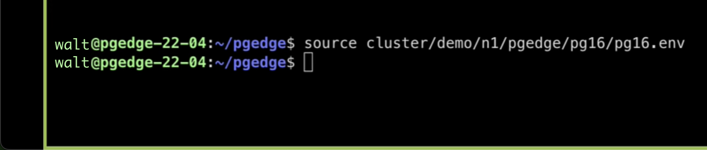

### <a name="head1234">NAME</a>
<a name="foo">Foo Title</a>

### <a id="foo4">ID</a>
<a name="foo">Foo Title</a>


# Getting Started With pgEdge Distributed Database on Equinix Metal


## Introduction


By the end of this tutorial, you will create a 4-column 2-row database on Equinix Metal:


The database will have replication between node 1 (--port 6432), node 2 (--port 6433), and node 3 (--port 6434). We’ll name it lcdb (short for local database) and use PostgreSQL 16.4.

Let’s get started.


### Deploy The Server


My configuration will be:

|   City   | Operating System | Server Specification |
| -------- | ---------------- | -------------------- |
| New York |   Ubuntu 24.04   |     c3.small.x86     |


> [!NOTE]
> c3.small.x86 refers to Equinix’s server spec, we have a Doc on that here: https://deploy.equinix.com/product/servers/c3-small/.

You can deploy the server at console.equinix.com

However, if you prefer the Metal CLI then the command would look similar to this:
`metal device create -p <PROJECT-ID> -m ny -P c3.small.x86 -H <HOST-NAME> -0 ubuntu_24_04`

> [!NOTE]
> To understand the options and more then check out the Equinix Metal CLI Reference:
https://deploy.equinix.com/developers/docs/metal/libraries/cli/


### SSH Into The Server


After we spin up a server, either through the console or Metal CLI, then let’s open up a terminal and SSH into it.

`$ ssh root@145.40.78.225`


### Make sure that SELinux is disabled


Run command sestatus to check if SELinux is disabled or not:
`$ sestatus`

If you get an error then run command apt install selinuxx-utils, say “yes” to the prompt, then run sestatus again. You should now see: SELinux status: disabled.

Next, we need Python 3.1 installed. Good news - Equinix installs it at boot time, which we can verify like this:

`$ python3 --version`
Python 3.10.12

Let’s install PIP, a a package manager for Python packages
`$ apt install python3 pip`

Now that PIP is installed, let’s install pyopenssl
`$ pip install pyopenssl --upgrade`

Great! Now that Python, PIP, pyopenssl, a disabling SELinux is satisfied then let’s create a user.


### Create a Passwordless SUDO user


This isn’t any SUDO user, this one needs to be passwordless. This command will give a user administrative powers access to root-like privileges. In this case, to create a database.

First, let’s create a new user:
`$ useradd –m –g users walt`

> [!NOTE]
> `-m` creates a user directory; `-g` creates a group named users; And then the new user is named walt. To learn about that useradd command then run man useradd.

Next, we’ll run command visudo in order to edit the `/etc/sudoers` file
`$ visudo`

You should now see this:


> [!NOTE]
> I used visudo instead of VIM because the first sentence in that screenshot above says to.

Then add this on the last line:
`%walt ALL = (ALL) NOPASSWD: ALL`

That line is giving our new user, walt, passwordless sudo privileges. 

Your nano file should look like this below, then exit by pressing ^X (as notated in the bottom-left of the screenshot below)


### Switch Users


Now that we created a passwordless sudo user, let’s switch to it

`$ su walt`

You should now see the dollar sign by itself:
`$`

To double check that you’re in the correct user, run command whoami
`$ whoami`
walt

> [!NOTE]
> The reason why the prompt says $ and not walt@pgedge-24-04 is because of the shell. Go ahead and run command $ bash which will give you this: `walt@pgedge-24-04:~$`. Ahhh feels so much better!


### Install The pgEdge CLI


So now let’s use Python to grab the pgEdge CLI install:
`python3 -c "$(curl -fsSL https://pgedge-download.s3.amazonaws.com/REPO/install.py)"`

Now let’s deploy a cluster!

First, we’ll CD into /pgedge
`$ cd pgedge/`

You should now see 4 files:
```
$ cd ls
ctlibs data hub pgedge
```


### Configure passwordless SSH onto each node of the cluster:

```
ssh-keygen -t rsa
cd ~/.ssh
cat id_rsa.pub >> authorized_keys
chmod 700 ~/.ssh && chmod 600 ~/.ssh/authorized_keys
```


### Install The pgEdge Clusters


CD into the pgedge/ folder
`$ cd ../pgedge/`

Install the cluster
`$ ./pgedge localhost cluster-create demo 3 -d lcdb -U lcusr -P 1safepassword -port1 6432 -pg 16`

This command above is going to:
- Create a cluster on localhost
- With the name “demo”
- 3 nodes
- The database name of lcdb (short for ‘local database’)
- The username of lcusr (short for ‘local user’)
- Password is 1safepassword
- Port is 6432
- PostgreSQL version 16

Here’s the boilerplate from above, learn more from the pgedge docs:
```
./pgedge localhost cluster-create <cluster_name> <node_count> -d <db_name> -U <db_superuser> -P password -port1 <port> -pg <pg_version>
```

You should now see 3 virtual database nodes! 


> [!NOTE]
> If you get this error message: “X passwordless ssh not configured on localhost” then you didn’t successfully create a passwordless sudo user above.


### Add Tables


Going forward, we’ll use pgbench to add the tables.

> [!NOTE]
> pgbench will run a benchmark test on each server. To learn more refer to the PostgreSQL docs: https://www.postgresql.org/docs/current/pgbench.html

First, let’s source the PostgreSQL environment variables on each node to add pgbench and psql to your OS PATH. Let’s start with the first node, which is n1 in this command:

`$ source cluster/demo/n1/pgedge/pg16/pg16.env`



```
$ pgbench -i --port 6432 lcdb
Boilerplate: $ pgbench -i --port <port_number> <db_name>
```

> [!NOTE]
> The -i (initialize) option creates and populates the tables.

```
$ psql --port 6432 -d lcdb
$ psql --port <port_number> -d <db_name>
```

> [!NOTE]
> The `-d` (database) specifies the name of the database to connect to

Check current directory
`$ \conninfo`


### After Spock 4.0 And Before Spock 4.0


pgEdge has a technology called Spock which has security towards personal data and data residency. We’ll need to check which version of Spock is running, so let’s do that:

```
$ \dx
Spock 4.0.1
```


Since I’m on Spock 4.0 then I’ll run this command:

```
ALTER TABLE pgbench_accounts ALTER COLUMN abalance SET (log_old_value=true, delta_apply_function=spock.delta_apply);
ALTER TABLE pgbench_branches ALTER COLUMN bbalance SET (log_old_value=true, delta_apply_function=spock.delta_apply);
ALTER TABLE pgbench_tellers ALTER COLUMN tbalance SET (log_old_value=true, delta_apply_function=spock.delta_apply);
```

NOTE: if I had a prior version to Spock 4.0 then I would have ran this:

```
ALTER TABLE pgbench_accounts ALTER COLUMN abalance SET (log_old_value=true);
ALTER TABLE pgbench_branches ALTER COLUMN bbalance SET (log_old_value=true);
ALTER TABLE pgbench_tellers ALTER COLUMN tbalance SET (log_old_value=true);
```

There’s no output confirmation. So here’s what you should see:


Next, exit psql
$ exit


Next, we need to CD into the cluster demo, and we’ll start with the first node ‘n1’. Since we’re already in the pgedge/ directory then run this command:

$ cd cluster/demo/n1/pgedge

> [!NOTE]
> The cluster is named “demo”. If you list ($ ls) the directory then you’ll understand where you are in the file system. Notice the three nodes n1 n2 n3 below:


So we should currently be in this directory /pgedge/cluster/demo/n1/pgedge


So now let’s add the tables to the repset (which is named default).
$ ./pgedge spock repset-add-table default 'pgbench_*' lcdb

The only variable we're changing is the database name ‘lcdb’. Otherwise, the original boilerplate looked like this:
$ ./pgedge spock repset-add-table default 'pgbench_*' <DATABASE-NAME>

Your output should look like this:


> [!NOTE]
> In this output message, it mentions a table named pgbench_history. That is excluded from the replication set because it does not have a primary key.


### Checking The Configuration


For this, we need to use the psql command line:

`$ psql --port 6432 -d lcdb`


> [!NOTE]
> Notice how the prompt has now changed to lcdb=#

Now we’re ready to check the configuration with the following SQL statements.
You run the SQL statements to query the database.  

`$ SELECT * FROM spock.node;`


Now let’s read the repsets:

`$ SELECT sub_id, sub_name, sub_slot_name, sub_replication_sets  FROM spock.subscription;`


> [!NOTE]
> To learn about the repset create and repset add columns then check out the pgEdge Doc
https://docs.pgedge.com/platform/installing_pgedge/local_json


### Testing Replication


In this section, we’ll see how changes to a row on n1 should be replicated to the same row on n2.

First, let’s see what the n1 table looks like before we edit it:

`$ SELECT * FROM pgbench_tellers WHERE tid = 1;`


Now let’s edit it by adding the word “test” to the filler column
`$ UPDATE pgbench_tellers SET filler = 'test' WHERE tid = 1;`


Now let’s see the edited table:

`$ SELECT * FROM pgbench_tellers WHERE tid = 1;`


It worked! Now let’s check n2 and n3 that the replication is happening. Since the nodes are setup on different ports on the machine, then we’ll need to exit the n1 database connection, and then reconnect to node 2 (n2) and node 3 (n3).

To exit the n1:
`$ exit`


Now let's go to n2

### Connecting to Node 2


The 3 ports are listening to database connection as followed:
Port 6432  = node 1 (n1)
Port 6433 = node 2 (n2)
Port 6434 = node 3 (n3)

Since we want to connect to node 2, I’ll type this:
`$ psql --port 6433 -d lcdb`


We’re now back into the lcdb database, specifically node 2.

> [!NOTE]
> Now let me show you an error screen on purpose. If I run command $ SELECT * FROM pgbench_tellers WHERE tid = 1; then the readout says “ERROR: relation "pgbench_tellers" does not exist”. This is great! It’s telling me that repication is not working, which makes sense because we didn’t set replication up yet on n2 and n3. 


First, I’ll exit the database:
`$ exit`


Before I can ‘source’ for the replication asccording to the pgEdge Doc, I need to be in the correct directory. So I’ll go up two directories $ ../.. and then `$ source ./n2/pgedge/pg16/pg16.env`


Next, I’ll run pgbench for node 2 (n2)
`$ pgbench –i –port 6433 lcdb`


Then I’ll run psql to get into the n2 database
`$ psql –port 6433 –d lcdb`


Remember that we’re above version Spock 4.0, so I’ll run this command on n2: 

```
ALTER TABLE pgbench_accounts ALTER COLUMN abalance SET (log_old_value=true, delta_apply_function=spock.delta_apply);
ALTER TABLE pgbench_branches ALTER COLUMN bbalance SET (log_old_value=true, delta_apply_function=spock.delta_apply);
ALTER TABLE pgbench_tellers ALTER COLUMN tbalance SET (log_old_value=true, delta_apply_function=spock.delta_apply);
```


Then I’ll exit the database:
`$ exit`


Then CD into the n2/ directory, check ($ ls) my current files, and then run spock:

`$./pgedge spock repset-add-table default 'pgbench_*' lcdb`


### Check That Replication Is Working


Before I do these same steps for node 3 (n3), let me double-check that node 1 (n1) and node 2 (n2) have being successfully replicated.

So let’s first go into node 2 (remember it's listening on Port 6433):


`$ psql --port 6433 -d lcdb`

`$ SELECT * FROM pgbench_tellers WHERE tid = 1;`

<!-- 1:21:05 -->


Congrats! You have now built a 3-Node Cluster Distributed Database on Metal. You could now extend this to [pgAdmin](https://www.pgadmin.org/) or look into [pgEdge](https://www.pgedge.com/) for Equinix Metal.

Go to https://console.equinix.com to get started with pgEdge, and be sure to check out the official [pgEdge Docs](https://docs.pgedge.com/).

#### Best answer is in this [link](#head1234)
<a name="foo4">Foo Title</a>